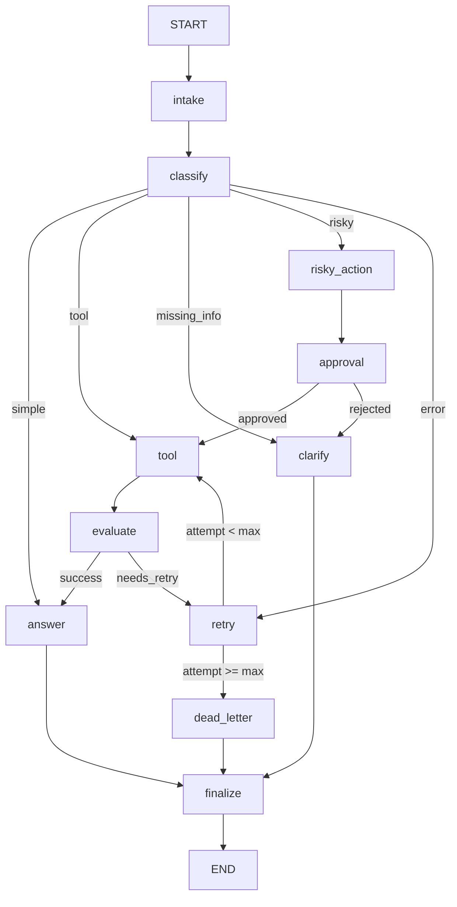

# Day 08 Lab Report — LangGraph Agentic Orchestration

## 1. Student

- Name: Nguyen Ky Anh
- Project: Production-style support-ticket agent
- Runtime: Python 3.11, LangGraph, LangChain chat models, Pydantic

## 2. Architecture

The workflow separates probabilistic language understanding from deterministic safety and
routing. `classify` uses an LLM with a Pydantic structured-output schema. Routing functions
then select explicit graph edges. Tool results are judged by an LLM-as-judge, with an
additional deterministic rule that an explicit `ERROR` can never be accepted as success.
Every route terminates through the shared `finalize` audit node.

## 3. State schema and reducers

| Field | Update behavior | Purpose |
|---|---|---|
| `query`, `route`, `risk_level` | overwrite | Current normalized request and routing decision |
| `attempt`, `max_attempts`, `evaluation_result` | overwrite | Bounded retry-loop control |
| `pending_question`, `proposed_action`, `approval` | overwrite | HITL safety state |
| `final_answer`, `classification_reason` | overwrite | Final output and explainability |
| `messages`, `tool_results`, `errors`, `events` | append reducer | Serializable audit history |

## 4. Metrics summary

| Metric | Value |
|---|---:|
| Total scenarios | 7 |
| Successful scenarios | 7 |
| Success rate | 100.00% |
| Average nodes visited | 6.43 |
| Total retries | 3 |
| Approval/HITL events | 2 |
| State-history recovery demonstrated | True |

## 5. Scenario results

| Scenario | Expected | Actual | Success | Nodes | Retries | HITL | Latency ms |
|---|---|---|---:|---:|---:|---:|---:|
| S01_simple | simple | simple | yes | 4 | 0 | 0 | 11686 |
| S02_tool | tool | tool | yes | 6 | 0 | 0 | 12861 |
| S03_missing | missing_info | missing_info | yes | 4 | 0 | 0 | 3812 |
| S04_risky | risky | risky | yes | 8 | 0 | 1 | 11561 |
| S05_error | error | error | yes | 10 | 2 | 0 | 15691 |
| S06_delete | risky | risky | yes | 8 | 0 | 1 | 11549 |
| S07_dead_letter | error | error | yes | 5 | 1 | 0 | 2846 |

## 6. Failure analysis

1. **Transient tool failure:** explicit error results are classified as `needs_retry`.
   `attempt` is incremented in one node and checked in a separate routing function, so the
   loop cannot run forever. Exhaustion routes to `dead_letter` and manual escalation.
2. **Risky action without approval:** side-effecting requests are prepared but not executed
   before the approval node. The tool also has a defense-in-depth check that blocks a risky
   action when approval is absent, even if graph wiring is accidentally changed.
3. **Provider outage or malformed output:** LLM calls use structured Pydantic schemas,
   request timeouts, bounded provider retries, and audited conservative fallbacks.
4. **Incomplete request:** vague input terminates with a targeted clarification question
   rather than hallucinating missing account or order details.

## 7. Persistence and recovery evidence

The lab configuration uses SQLite with WAL mode. Every graph invocation receives a unique
`thread_id`. Automated tests execute a workflow, close the SQLite connection, create a new
checkpointer, and verify that the final state and complete state history are still available.
State-history replay observed during scenario execution: **True**.

## 8. Extensions completed

- Real optional HITL with `interrupt()` when `LANGGRAPH_INTERRUPT=true`.
- SQLite crash/restart recovery and optional PostgreSQL adapter.
- LLM-as-judge structured evaluation.
- Mermaid graph diagram embedded in this report and exportable from the CLI.
- Per-node audit events, provider latency, retry/error, and approval metrics.
- Provider-independent LLM factory for Gemini, OpenAI, and Anthropic.

## 9. Improvement plan

The next production step would replace the mock tool with authenticated, idempotent service
clients and durable action IDs. Then add distributed tracing, prompt/version evaluation,
role-based approval, PII redaction, rate limiting, and adversarial hidden-scenario tests.
